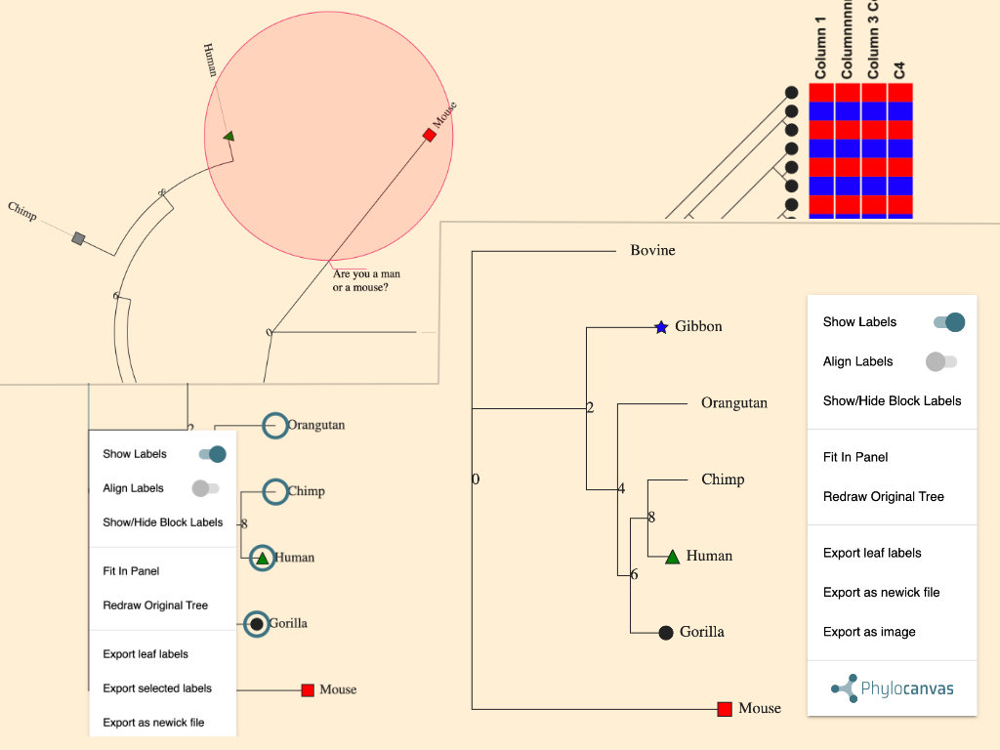

# Phylocanvas 3 
Phylogeny visualisation library for Newick tree format.

Forked from phylocanvas-3 branch developed by [The Centre for Genomic Pathogen Surveillance](https://www.pathogensurveillance.net/)




## Packages
- [`@mkoliba/phylocanvas`](): main package containing visualisation library 
- [`@mkoliba/phylocanvas-plugin-context-menu`](): adds context menu 
- [`@mkoliba/phylocanvas-plugin-interactions`](): adds interation features such as zoom, highlight, selection, view of subtree
- [`@mkoliba/phylocanvas-plugin-scalebar`](): adds a scalebar to bottom left corner of canvas for length reference. 

add package to your project using `yarn add` or `npm install -S`

## development guide
Clone repository and run: 
```
yarn install
```

### Top-level commands
Start a development build, with optional testing page. `page` should match a folder in `./dev/pages`.
```bash
yarn start [page]
```

Available pages with examples:
- annotations
- context-menu
- interactions
- metadata
- scalebar
- tooltip

Run yarn build inside each package, can be optionally scoped using the full package name, i.e. not the directory name.
```bash
yarn build [--scope=@mkoliba/phylocanvas-plugin-name]
```

Link every package globally.
```bash
yarn run link
```

## Publishing a new version

1.  Run a new build (see above) and commit it.

2.  Login to npm

3.  Run `yarn release`.

[for beta releases, choose "Custom Version" and enter "3.0.0-beta.{number}"]


